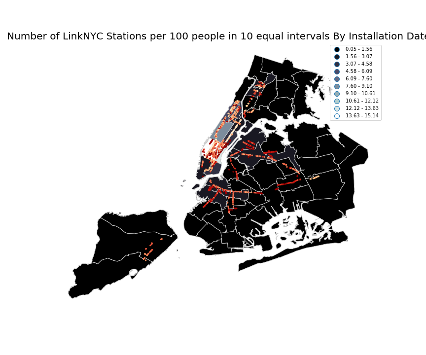
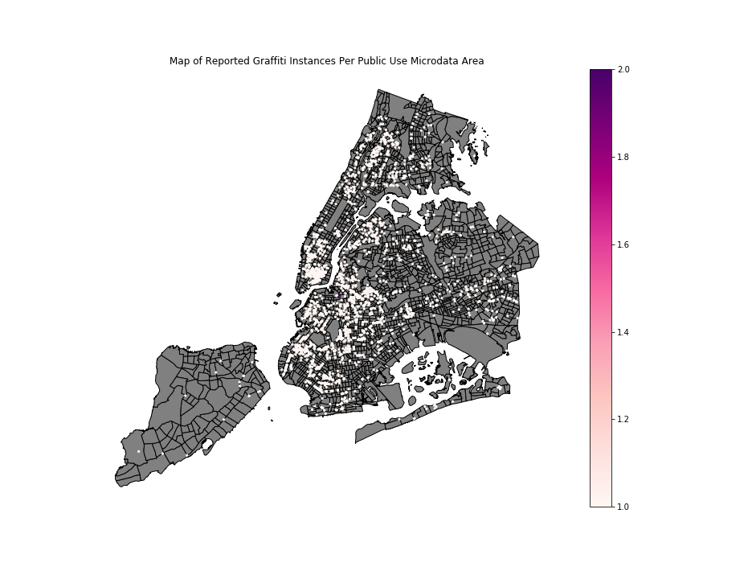

# Maps Related Projects

This is a repository for projects using NYC Open Data and working with Geopandas

## LinkNYC Access Points

#### Problem Statement

According to the [linkNYC](https://www.link.nyc/) site, the access points popping up across nyc are a new communications network that will replace the old dial phone booths. The intent for these LinkNYC access points are so that high-speed wifi could now be more widely spreadout across the city and provide a more "democratic" opportunity of access to the internet.

This following study is to attempt an assessment of this goal. Are the linkNYC stations in fact providing greater access to areas that need it most?

This will leverage multiple sources of data including the census and the PUMA datasets from NYC Open Data.

#### Findings

## NYC Graffiti

#### Problem Statement

The NYC Open Data has an interesting dataset on the reported instances of graffiti across the city. In general my initial reaction to this dataset was why do we track it? Does it actually more closely reflect the people of NYC's tolerance for graffiti in their neighborhoods and could there actually be under reporting the true instances of graffiti. 

In general this is an exploration exercise to describe where we are seeing these instances reported. 

#### Findings

